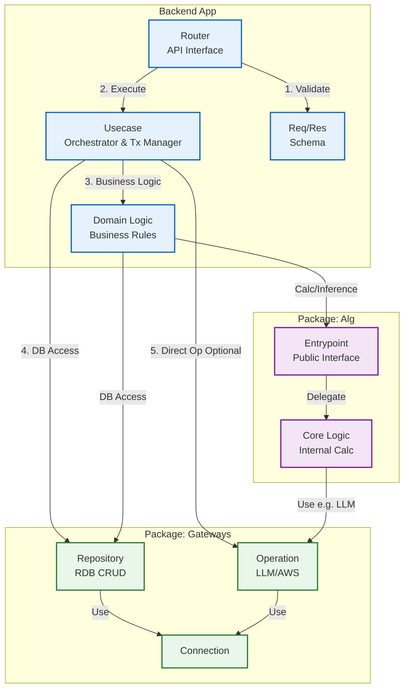
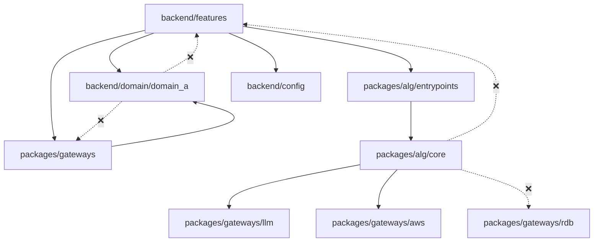

## 1. プロジェクト概要 (Project Overview)

本プロジェクトは、**Vertical Slice Architecture (機能単位の分割)** と **DDD (ドメイン駆動設計)** の要素を組み合わせた構成を採用しています。
「機能の独立性」と「計算ロジックの純粋性」を重視し、人間とAIの双方が理解しやすい構造を目指しています。

---

## 2. ディレクトリ構成と役割 (Directory Structure & Roles)

```
project_root/
└── backend/                    # [Backend] モノレポ構成
    ├── pyproject.toml          # ワークスペース設定
    │
    ├── api/                    # [Backend App] FastAPI
    │   ├── src/
    │   │   ├── app.py          # FastAPIエントリーポイント
    │   │   │
    │   │   ├── config/         # [Config] Backend固有の設定
    │   │   │
    │   │   ├── domain/         # [Core] ドメイン層
    │   │   │   └── domain_a/   # ドメインA (Pydantic)
    │   │   │       ├── model.py    # データモデル
    │   │   │       └── logic.py    # ビジネスロジック
    │   │   │
    │   │   └── features/       # [App] 機能単位のモジュール (Vertical Slices)
    │   │       └── {feature_name}/
    │   │           ├── router.py   # API入口 (Validation & Usecase呼び出し)
    │   │           ├── usecase.py  # 手順・ロジック・トランザクション管理
    │   │           └── request_and_response.py  # API用 I/O定義
    │   │
    │   └── tests/              # テストコード
    │
    └── packages/               # 共有パッケージ群
        ├── alg/                # [Logic] アルゴリズム・計算ロジック
        │   ├── sandbox/        # 検証用スクリプト（モジュール化前）
        │   └── alg/            # パッケージ名と同じディレクトリ (⚠️ src/ではない)
        │       ├── core/       # [Foundation] 内部ロジックの部品 (最下層)
        │       │   └── {module_name}/  # モジュール名 (例: alg1)
        │       │       ├── tools/      # 単機能関数群
        │       │       └── pipelines/  # 複数のToolを組み合わせた処理フロー
        │       ├── entrypoints/    # [Public] SWから呼び出す公開インターフェース (本番用)
        │       │   └── {function_name}.py  # core/の複数モジュールを統合
        │       └── experimental/   # [Experimental] 検証段階のインターフェース (sandbox用)
        │           └── {function_name}.py  # core/の複数モジュールを統合 (entrypointsと同様)
        │
        └── gateways/           # [External] 外部システム接続
            └── gateways/       # パッケージ名と同じディレクトリ (⚠️ src/ではない)
                ├── rdb/        # RDB接続
                │   ├── connections.py
                │   ├── models/     # ORM定義 (SQLAlchemy)
                │   └── operations/
                │       └── repositories/  # CRUD (Commitしない)
                │
                ├── llm/        # LLM接続 (OpenAI等)
                │   ├── connections.py
                │   ├── models/
                │   └── operations/
                │       └── llm_operations.py
                │
                └── aws/        # AWS接続 (S3等)
                    ├── connections.py
                    ├── models/
                    └── operations/
```

---

## 2.1 パッケージ構造のルール (Package Structure Rules)

### ⚠️ 重要: パッケージディレクトリ名の規則

共有パッケージ（`alg`, `gateways`）は、**パッケージ名と同じディレクトリ名**を使用します。

```
❌ 間違った構造（使用禁止）:
backend/packages/alg/src/entrypoints/...
backend/packages/gateways/src/llm/...

✅ 正しい構造:
backend/packages/alg/alg/entrypoints/...
backend/packages/gateways/gateways/llm/...
```

### 理由

1. **Importパスの簡潔性**
   - `src/`を使うと: `from alg.src.entrypoints import ...` （冗長）
   - パッケージ名と同じにすると: `from alg.entrypoints import ...` （シンプル）

2. **Pythonパッケージング標準に準拠**
   - PEP 517/518に基づく現代的なパッケージ構造
   - `pyproject.toml`の`packages`設定がシンプルになる

3. **モノレポでの一貫性**
   - パッケージ名とディレクトリ名が一致することで、構造が直感的

### pyproject.tomlの設定例

```toml
# backend/packages/alg/pyproject.toml
[tool.hatch.build.targets.wheel]
packages = ["alg"]  # src/ではなくalg/

# backend/packages/gateways/pyproject.toml
[tool.hatch.build.targets.wheel]
packages = ["gateways"]  # src/ではなくgateways/
```

### Importパスの例

#### ✅ 正しいImportパターン

```python
# API → alg
from alg.entrypoints.sample_entrypoint import calculate_with_description

# API → gateways
from gateways.llm.connections import get_openai_client
from gateways.rdb.operations.repositories.user_repository import UserRepository

# alg → gateways (alg内部でgatewaysを使う)
from gateways.llm.operations.llm_operations import LLMOperations
```

#### ❌ 間違ったImportパターン（使用禁止）

```python
# src/を含むパスは使わない
from alg.src.entrypoints.sample_entrypoint import calculate_with_description
from gateways.src.llm.connections import get_openai_client
```

### 検証方法

依存関係が正しく設定されているかは、以下のテストで確認できます:

```bash
cd backend/api
uv run pytest tests/api/test_dependency.py -v
```

---

## 3. レイヤーごとの実装ルール (Implementation Rules)

### 🧩 `backend/api/src/features` (機能・ユースケース)

- **役割**: アプリケーションの機能（エンドポイント）単位でフォルダを分割する。
- **`router.py`**: APIの入口。入力検証を行い、`usecase.py` を呼び出す。ロジックは書かない。
- **`usecase.py`**:
    - アプリケーションの手順（フロー）を記述する。
    - `backend/api/src/domain/domain_a`, `alg` (packages), `gateways` (packages) を組み合わせて目的を達成する。
    - **DBトランザクション (`commit`/`rollback`) の管理責任** を持つ。
- **依存ルール**: 他の `features` フォルダを直接 import してはいけない。共通化が必要な場合は `domain/domain_a` や `backend/packages/alg` に移動する。

### 🏛️ `backend/api/src/domain/domain_a` (ドメインモデル)

- **役割**: アプリケーション全体で共有される「ビジネスデータ」と「そのデータ自身のルール」。
- **model.py**: Pydantic モデルを使用したデータモデル定義。
- **logic.py**: ビジネスロジック（計算や状態遷移）。
- **禁止事項**: I/O操作、他レイヤー（features, gateways）への依存。

### 🧠 `backend/packages/alg` (アルゴリズム)

**3層構造**:
```
sandbox/ → experimental/ → entrypoints/
              ↓              ↓
            core/ (共通の内部ロジック部品)
```

- **`core/` (Foundation - 内部ロジックの部品)**:
    - モジュール単位で分割された純粋関数の集まり（最下層）。
    - **`{module_name}/tools/`**: ステートレスな単機能関数群。
    - **`{module_name}/pipelines/`**: 複数のToolを組み合わせた処理フロー。
    - **ルール**: 純粋関数であることを目指す。RDB接続は行わない（LLM, AWSのみ可）。
    - entrypoints/とexperimental/の両方から呼び出される。
- **`entrypoints/` (Public Interface - 本番用)**:
    - `backend/api/src/features` (Usecase) が import してよい **唯一の入口**。
    - **core/の複数モジュールを統合**して、ビジネスロジックとして提供 (Facadeパターン)。
    - 本番環境で使用される確定したAPIのみを配置。
- **`experimental/` (Experimental Interface - 検証用)**:
    - **core/の複数モジュールを統合**した検証段階の関数。
    - entrypointsと同様の実装スタイル（core/を組み合わせる）。
    - sandboxから `from alg.experimental.xxx import ...` で利用可能。
    - 検証が完了したら `entrypoints/` に昇格させる。
- **`sandbox/` (Verification Scripts)**:
    - モジュール化する前の検証用スクリプト。
    - ファイル命名規則: `{名前}/{n|s}_{日付}_{実施内容}.py`

### 🔌 `backend/packages/gateways` (ゲートウェイ・外部接続)

- **役割**: DB, AWS, OpenAI などの外部システムとの接続と操作。
- **サービスごとにフォルダを分割**: `rdb/`, `llm/`, `aws/`
- **各サービスの構成**:
    - `connections.py`: クライアント生成・接続管理
    - `models/`: データモデル (ORMモデルなど)
    - `operations/`: 実際の操作実装 (CRUD、API呼び出しなど)
- **`operations/repositories/`**: 単純なCRUD (Write/Read)。ここで **Commitはしない**。
- **戻り値**: `backend/api/src/domain/domain_a` のモデルに変換 (ORMオブジェクトを流出させない)。

### ⚙️ `backend/api/src/config` (設定管理)

- **役割**: Backend固有の設定を管理。環境変数を定義したり、Typed Configを提供する。
- **ルール**: アプリケーションコード内で `os.getenv` を直接使用せず、必ず `src/config/config.py` 経由で値を取得する。

---

## 4. データフローと依存関係 (Flow & Dependency)

依存の方向は原則として **[詳細] -> [抽象/コア]** です。

### 4.1 依存関係の全体像

以下の図は、Backend App内の各レイヤーと共有パッケージ間の依存関係を詳細に示しています。



### 4.2 依存関係フローの説明

1. **API Request Flow (リクエストの受信)**
   - **Router**: リクエストを受信し、`Req/Res Schema`でバリデーション
   - **Router → Usecase**: バリデーション後、Usecaseを実行

2. **Usecase Orchestration (オーケストレーション)**
   - **Usecase → Domain**: ビジネスロジックを呼び出し
   - **Usecase → Repository**: DB操作を実行（トランザクション管理）
   - **Usecase → Operation**: 必要に応じてLLM/AWS操作を直接実行

3. **Domain Logic (ドメインロジック)**
   - **Domain → Alg Entrypoint**: 複雑な計算・推論をAlgに委譲
   - **Domain → Repository**: DB読み取り操作（軽量なクエリ）

4. **Algorithm Internals (アルゴリズム内部)**
   - **Alg Entrypoint → Alg Core**: 公開インターフェースが内部ロジックに委譲
   - **Alg Core → Operation**: LLM/AWS操作を利用（RDB接続は禁止）

5. **Infrastructure (インフラストラクチャ)**
   - **Repository → Connection**: DB接続を利用
   - **Operation → Connection**: 外部サービス接続を利用

### 4.3 依存関係ルール

```
backend/api/src/features → backend/api/src/domain/domain_a
backend/api/src/features → backend/packages/alg (entrypoints)
backend/api/src/features → backend/packages/gateways
backend/api/src/features → backend/api/src/config

backend/packages/alg/core → backend/packages/gateways/llm (LLM接続のみ)
backend/packages/alg/core → backend/packages/gateways/aws (AWS接続のみ)
backend/packages/alg/entrypoints → backend/packages/alg/core

backend/packages/gateways → backend/api/src/domain/domain_a

❌ backend/api/src/domain/domain_a → backend/api/src/features
❌ backend/api/src/domain/domain_a → backend/packages/gateways
❌ backend/packages/alg/core → backend/api/src/features
❌ backend/packages/alg/core → backend/packages/gateways/rdb (RDB接続は禁止)
```

### 4.4 モジュール依存関係の簡略図

モジュール間の依存関係を簡略化した図です。



### ランタイムフロー例 (Runtime Sequence)

1. **Router**: `backend/features/case1/router.py` がリクエストを受信。
2. **Usecase**: `backend/features/case1/usecase.py` がトランザクションを開始。
3. **Config**: `backend/config` から設定値（閾値など）を取得。
4. **Gateway**: `packages/gateways/rdb/operations/repositories` からデータを取得 -> `backend/domain/domain_a` に変換。
5. **Alg**: `packages/alg/entrypoints` 経由で計算を実行。
6. **Gateway**: 結果を `packages/gateways/rdb/operations` 経由で保存。
7. **Usecase**: トランザクションを **Commit**。
8. **Router**: レスポンスを返却。
